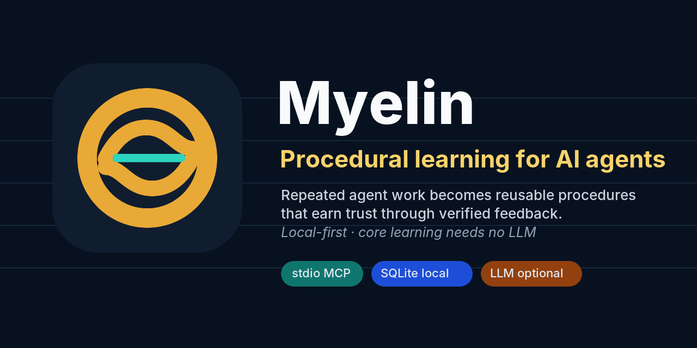

<p align="center">
  
</p>

<p align="center">
  <a href="https://github.com/Niraven/myelin/actions/workflows/ci.yml"></a>
  
  
  
  <a href="LICENSE"></a>
</p>

<p align="center">
  <strong>mem0 remembers. Myelin learns.</strong>
</p>

Myelin is a procedural learning layer for AI agents. It observes agent behavior, learns reusable workflows, assembles actionable context, and transfers learned procedures across agents via MCP.

Named after the biological myelin sheath that accelerates neural signal transmission, Myelin accelerates AI agents by helping them reuse what worked instead of rediscovering the same workflow every session.

Myelin can learn from any AI system that emits structured observations: single agents, coding assistants, delegated teams, swarms, and orchestrated runtimes. It does not replace orchestration, planning, task management, or generic fact memory.

> Orchestrators coordinate agents. Myelin learns from what agents repeatedly do.

## Start Here

- Run the proof demo: `python examples/procedure_learning_demo.py`
- Read the launch plan: [docs/LAUNCH_PLAN.md](docs/LAUNCH_PLAN.md)
- Use the launch copy: [docs/LAUNCH_KIT.md](docs/LAUNCH_KIT.md)
- Use the brand assets: [docs/BRAND.md](docs/BRAND.md)
- Use the launch video source: [assets/hyperframes/myelin-launch](assets/hyperframes/myelin-launch)
- Read the changelog: [CHANGELOG.md](CHANGELOG.md)
- Understand the lineage: [docs/LINEAGE.md](docs/LINEAGE.md)
- Compare the category: [docs/COMPARISONS.md](docs/COMPARISONS.md)
- Integrate agents: [docs/integrations/README.md](docs/integrations/README.md)
- Wire Hermes: [docs/integrations/hermes.md](docs/integrations/hermes.md)
- Emit observations: [docs/OBSERVATION_SCHEMA.md](docs/OBSERVATION_SCHEMA.md)
- Benchmark locally: [docs/PERFORMANCE.md](docs/PERFORMANCE.md)

## Why Myelin

Most agent memory systems store and retrieve text. Myelin does more:

- **Learns procedures automatically.** Watches what agents do, clusters similar action sequences, aligns them using ClustalW-inspired multiple sequence alignment, and promotes recurring patterns into reusable procedures with Bayesian confidence tracking.
- **Builds knowledge graphs from observations.** Extracts entities (tools, services, files, errors) from every action, infers typed relationships, and maintains an evidence-weighted graph that grows with usage.
- **Tracks temporal state.** Knows that Redis was healthy 2 hours ago but is degraded now. Maintains full state transition history for every entity.
- **Assembles context, not just search results.** When an agent needs to act, Myelin combines relevant memories, matching procedures, entity relationships, temporal state, and domain confidence into a single structured context block.
- **Transfers knowledge between agents.** Packages procedures with capability-aware adaptation so knowledge learned by one agent can be used by another, even with different toolsets.

## Proof Demo

Run the demo to watch Myelin observe five repeated deployment workflows, promote the shared sequence into a learned procedure, execute it, and update confidence from success feedback.

```bash
uv run --python /Users/niamamor/.local/bin/python3.11 --with-editable ".[dev]" \
  python examples/procedure_learning_demo.py
```

Expected shape:

```text
Myelin procedure-learning demo
Episodes observed: 25
Procedures created: 1
Learned procedure: auto_git_npm_docker
Initial confidence: 75%
Trust level: candidate
Recommendation: suggest_only_review_before_execution
Confidence after success feedback: 79%
Trust after feedback: validated
```

This is the core product claim: repeated behavior becomes an executable procedure without an LLM call.

For orchestrated agent systems, run:

```bash
uv run --python /Users/niamamor/.local/bin/python3.11 --with-editable ".[dev]" \
  python examples/hermes_procedure_demo.py
```

This simulates Hermes coordinating research, build, and release agents across noisy CI-repair runs. Myelin learns the shared workflow while keeping Hermes responsible for routing and approvals.

## Architecture

```
                    MCP Interface (21 tools)
                           |
            +--------------+--------------+
            |              |              |
     Intelligence    Memory Layer    Knowledge Layer
     (context        (episodic,      (entities,
      assembly)       semantic,       graph,
                      procedural)     temporal)
            |              |              |
            +--------------+--------------+
                           |
                  Cognitive Processes
           (consolidation, reflection,
            promotion, composition,
            decay, challenge, sleep)
                           |
                    SQLite + FTS5
```

**Memory Layer** stores three types of memory, mirroring human cognitive architecture:
- **Episodic**: raw observations of what happened (what, when, outcome)
- **Semantic**: distilled facts and reflections (consolidated from episodes)
- **Procedural**: learned step-by-step workflows (promoted from clusters)

**Knowledge Layer** maintains structured understanding:
- **Entity Store**: pattern-based NER extracts tools, services, files, errors from every observation. No LLM dependency.
- **Knowledge Graph**: typed, evidence-weighted edges between entities. BFS/DFS traversal, domain subgraphs.
- **Temporal Index**: tracks entity state over time with automatic supersession and transition history.

**Cognitive Processes** run in the background, triggered by write counts, timers, or session boundaries:
- **Reconsolidator**: opens lability windows and updates memories when prediction error warrants it.
- **Prediction Learner**: tracks predicted vs actual procedure outcomes and surprise.
- **Consolidator/Reflector**: distills episodes into semantic facts and cross-domain insights.
- **NREM/REM Sleep**: strengthens useful traces, downscales noise, replays priority episodes, and explores counterfactuals.
- **Promoter/Composer**: promotes repeated action sequences into procedures and chains compatible procedures.
- **Schema/Curiosity/FSRS/Self-Model**: induces behavioral schemas, detects learning gaps, schedules review, and tracks calibration.

**Intelligence Layer** is the primary interface for agents:
- **Context Assembler**: fuses all signals into a structured context block with suggested actions
- **Multi-Signal Retriever**: ranks results using 5 fused signals (FTS + vector + entity + temporal + ACT-R activation)

**Transfer Protocol** enables cross-agent knowledge sharing:
- Agent profiling (tools, model family, context format)
- Capability-aware step adaptation
- Confidence discounting based on agent similarity

## How Agents Use Myelin

Myelin is a shared procedural learning layer underneath agent runtimes. It does not watch processes automatically, and it does not replace the agent or orchestrator. Agents explicitly call Myelin through MCP when they need context, when they finish useful actions, and when they want to reuse a learned workflow.

Current transport: Myelin ships as a local stdio MCP server using `python -m myelin.server`. Remote HTTP or Streamable HTTP transport is useful for shared network services, but it is not part of the current server yet.

The normal learning loop:

```text
agent plans task
  -> myelin_context at task boundary
  -> myelin_observe_batch during workflow
  -> myelin_sleep at session end
  -> myelin_execute_procedure on repeated task
  -> myelin_procedure_feedback after execution
```

The cross-agent transfer loop:

```text
source agent learns procedure
  -> myelin_transfer_discover checks fit
  -> myelin_transfer_export packages intent and evidence
  -> myelin_transfer_import creates target draft with confidence discount
  -> target agent runs, reports feedback, and calibrates confidence
```

Start with a small tool allowlist: `myelin_context`, `myelin_observe`, `myelin_observe_batch`, `myelin_execute_procedure`, `myelin_procedure_feedback`, `myelin_status`, and `myelin_sleep`. Keep transfer, graph, teach, and profile tools gated until the integration is trusted.

Integration guides:

- [Universal MCP guide](docs/integrations/README.md)
- [Hermes](docs/integrations/hermes.md)
- [Codex](docs/integrations/codex.md)
- [Claude Code](docs/integrations/claude-code.md)
- [OpenClaw](docs/integrations/openclaw.md)
- [Generic MCP clients](docs/integrations/generic-mcp.md)

## Quick Start

### Install

```bash
pip install myelin-memory
```

### As MCP Server

Add to your MCP client config:

```json
{
  "mcpServers": {
    "myelin": {
      "command": "python",
      "args": ["-m", "myelin.server", "--embedding-model", "none"],
      "env": {}
    }
  }
}
```

This is a stdio MCP server. Do not configure it as an HTTP URL unless you run it behind a separate bridge.

### Verify Procedure Learning

From a checkout:

```bash
pip install -e ".[dev]"
python examples/procedure_learning_demo.py
```

The demo observes repeated deployment actions and returns a learned procedure:

```text
Learned procedure: auto_git_npm_docker
Steps:
  1. git pull origin main
  2. npm test
  3. docker build myelin:latest
  4. docker push registry/myelin:latest
  5. kubectl rollout restart deployment/myelin
```

### Programmatic Usage

```python
from myelin.core.database import Database
from myelin.session import Session

db = Database("agent_memory.db")
session = Session(db, agent_id="my-agent")

# Record observations
await session.observe(
    action="git pull origin main",
    action_type="tool_call",
    content_text="Pulled latest changes from main branch",
    domain="deployment",
)

# End session triggers cognitive processes
results = await session.end()
```

### Key MCP Tools

| Tool | Purpose |
|------|---------|
| `myelin_observe` | Record an action with automatic entity extraction |
| `myelin_observe_batch` | Record many actions in one transaction for orchestrators |
| `myelin_context` | Assemble complete context for a situation (primary tool) |
| `myelin_query` | Multi-signal retrieval across all memory types |
| `myelin_execute_procedure` | Find matching learned procedure for a task |
| `myelin_procedure_feedback` | Report success/failure to update confidence |
| `myelin_graph_query` | Explore knowledge graph relationships |
| `myelin_temporal` | Query temporal state of entities/domains |
| `myelin_what_changed` | Show state transitions in a domain since a timestamp |
| `myelin_entity_status` | Show current status and recent transitions for an entity |
| `myelin_entities` | Search extracted entities |
| `myelin_teach` | Manually teach a procedure |
| `myelin_transfer_export` | Package procedure for another agent |
| `myelin_transfer_import` | Import procedure from another agent |
| `myelin_transfer_discover` | Find transferable procedures between agents |
| `myelin_visualize` | Export the knowledge graph as Mermaid or D3 JSON |
| `myelin_profile` | Summarize learned profile facts for an agent |
| `myelin_confidence` | Query domain/procedure confidence |
| `myelin_sleep` | Trigger sleep consolidation and procedure promotion |
| `myelin_recall` | Basic search across memory types |
| `myelin_status` | System status overview |

## What Makes Myelin Different

Most memory systems are built around recall: store facts, retrieve relevant text, and feed it back into context. Myelin is built around learning reusable agent behavior.

| Capability | Myelin approach |
|------------|-----------------|
| Procedure learning | Clusters repeated action sequences and extracts consensus workflows |
| Determinism | Core learning uses local algorithms instead of LLM-only extraction |
| Context assembly | Combines memories, procedures, entities, temporal state, and confidence |
| Confidence | Updates procedures with Bayesian feedback after execution |
| Transfer | Adapts procedures across agents with different tool capabilities |
| Deployment | Local-first SQLite with optional embeddings |

Systems like mem0 and Supermemory are strong references for fact recall and retrieval. Myelin is aimed at the next layer: letting AI systems learn how work gets done.

Hermes is the first flagship integration path, not the boundary of the product:

> Hermes operates. Myelin learns the operating procedures.

Myelin is also the focused successor to [Sigil](https://github.com/Niraven/sigil-memory), an earlier broad local-first agent memory prototype. See [docs/LINEAGE.md](docs/LINEAGE.md) for what Myelin absorbed and what it intentionally leaves out.

## How Promotion Works

```
Agent actions --> Episodes --> Cluster detection --> ACT-R activation scoring
  --> ClustalW sequence alignment --> Consensus extraction --> Procedure creation
  --> Bayesian validation --> SOAR composition check --> Active procedure
```

## Math

**ACT-R Activation**: `B(i) = ln(sum_j(t_j^(-d)))` where t_j is time since j-th access, d=0.5 decay

**Bayesian Confidence**: On success: `c = c + (1-c) * 0.15`. On failure: `c = c * (1 - 0.15)`. Bounded [0.05, 0.99].

**Ebbinghaus Decay**: `R = e^(-t/S)` where t is time in hours, S is stability

**Multi-Signal Score**: `0.25*text + 0.25*vector + 0.20*entity + 0.15*temporal + 0.15*activation`

**Temporal Score**: `confidence * 0.4 + recency * 0.3 + currency_boost * 0.3`

## Research Foundation

Myelin combines ideas from established cognitive architectures:
- **ACT-R** (Carnegie Mellon, 40+ years) -- activation equations for memory retrieval and promotion scoring
- **SOAR** (Michigan, 40+ years) -- chunking for procedure composition, impasse detection for learning goals
- **Stanford Generative Agents** (Park et al., 2023) -- reflection for higher-order knowledge synthesis
- **CoALA** (Princeton, 2023) -- modular memory architecture with structured action spaces
- **ClustalW** (Thompson et al., 1994) -- progressive multiple sequence alignment adapted for action sequences

## Project Structure

```
src/myelin/
  core/           schema, models, database, activation math
  memory/         episodic, semantic, procedural, clustering, alignment, retriever
  knowledge/      entities, graph, temporal
  intelligence/   context assembler
  cognitive/      consolidator, reflector, promoter, composer, decayer, challenger, sleep
  metacognition/  confidence maps, impasse detection
  transfer/       agent profiling, transfer protocol
  tools/          MCP tool handlers
  server.py       MCP server entry point
  session.py      session lifecycle
```

## Tech Stack

- Python 3.11+
- SQLite + FTS5 (full-text search) + sqlite-vec (vector search)
- MCP (Model Context Protocol) for agent integration
- Pydantic for data models
- Optional: nomic-embed-text-v1.5 for local embeddings

## Performance

Myelin's public speed story is agent acceleration: agents spend less time rediscovering repeated workflows because they can reuse learned procedures.

Run a local benchmark:

```bash
python -m myelin.benchmark --counts 1000 --json
```

See [docs/PERFORMANCE.md](docs/PERFORMANCE.md) for fast trace, semantic, and hybrid modes.

## Development

```bash
git clone https://github.com/Niraven/myelin.git
cd myelin
pip install -e ".[dev]"
ruff format --check src/ tests/ examples/
ruff check src/ tests/ examples/
mypy src/myelin/ --ignore-missing-imports
pytest tests/ -q
python examples/procedure_learning_demo.py
python examples/hermes_procedure_demo.py
```

## Community

- Contributing guide: [CONTRIBUTING.md](CONTRIBUTING.md)
- Security policy: [SECURITY.md](SECURITY.md)
- Brand guide: [docs/BRAND.md](docs/BRAND.md)

## License

MIT
