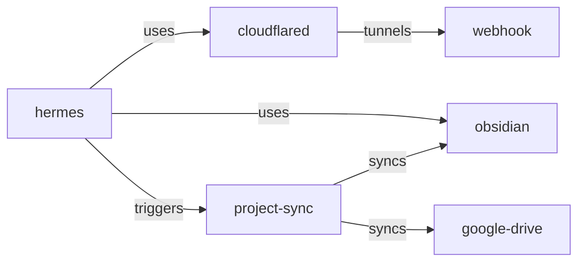

# Myelin: The Learning OS for AI Agents

> "mem0 remembers. Myelin learns."

Myelin is not another memory database. It is a **learning layer** — a system that observes agent behavior, discovers patterns, builds knowledge graphs, transfers learned skills between agents, and gets measurably smarter over time.

This document captures the full vision, current architecture, competitive positioning, and phased roadmap. It is a living document.

---

## 1. The Vision

Agents today are amnesiacs. Every session is a fresh start. Every workflow is re-discovered. Every failure is re-experienced.

The state of the art (mem0, Supermemory, ChatGPT memory) stores and retrieves text. Myelin stores and retrieves **competence**.

When Hermes runs a deployment 5 times, Myelin learns the deployment procedure. When Zo encounters the same task, Myelin transfers the procedure — adapted to Zo's toolset. When the deployment fails midway, Myelin adjusts confidence and suggests improvements.

**The end state:** An agent that has used Myelin for 3 months is demonstrably more competent than an identical agent with no Myelin. Faster task completion, fewer errors, better context awareness.

This is not a memory product. It is a **learning accelerator** for any AI system that emits structured observations.

---

## 2. What Exists Today

### Current capabilities (production-ready)

| Component | Status | Notes |
|-----------|--------|-------|
| Episodic memory | ✅ Stable | SQLite + FTS5. Records agent actions with full context |
| Procedural memory | ✅ Stable | Taught procedures with Bayesian confidence, ACT-R activation |
| Multi-signal retriever | ✅ Fixed | FTS5 + vector + entity + temporal + activation — OR-based |
| Knowledge graph | ✅ Working | Entity extraction, mentions, typed relationships |
| Temporal tracking | ✅ Working | State transitions per entity |
| Local embeddings | ✅ Fixed | nomic-embed-text-v1.5 (768d) via sentence-transformers |
| Sleep consolidation | ✅ Fixed | Relationships, temporal updates, cross-domain linking |
| Entity extraction | 🟡 Basic | Regex-based NER — misses conceptual entities |
| Semantic memory | 🟡 Basic | Consolidation clusters by domain, no LLM synthesis |
| Agent transfer | 🟡 Implemented | Export/import procedures between agents |
| Context assembly | 🟡 Basic | Combines signals into flat text block |
| Confidence mapping | 🟡 Stub | Domain confidence tracked but not used for decisions |

### Current gaps (from real usage)

1. **Entity extraction misses everything interesting.** Regex patterns catch `git`, `npm`, `GitHub` but not "Google Drive", "project sync workflow", "the database migration pattern". This is the #1 reason the knowledge graph feels sparse.

2. **Retrieval dumps raw episodes, not answers.** When asked "what happened with the sync setup?", Myelin returns 6 ranked episodes. The agent has to read them all to understand what happened. It should synthesize.

3. **No importance weighting.** A one-off test run and a critical production fix are stored identically. Myelin can't tell "this matters" from "this is noise."

4. **Procedures are write-once.** Taught at confidence 0.7, never adapt. No automatic refinement from usage feedback.

5. **Cold start is slow.** 700MB nomic-embed model loads in ~5s. Feels heavy for what should be a snappy local component.

6. **No cross-session personality.** Doesn't learn user preferences, priorities, or communication style. mem0 has this. Myelin should too.

7. **No importance-based forgetting.** Every episode lives forever. No decay. An agent with 10,000 episodes has no way to focus on what matters.

---

## 3. Competitive Landscape

### Myelin vs mem0

| Dimension | mem0 | Myelin |
|-----------|------|--------|
| Extraction | LLM-powered entity extraction | Regex-based (weakness) + planned LLM hybrid |
| Retrieval | Semantic + BM25 + entity | FTS5 + vector + entity + temporal + ACT-R activation |
| Synthesis | Returns facts with search results | Returns raw episodes (weakness — planned fix) |
| User profiling | Excellent — preference learning | None (planned) |
| Procedures | None | Full procedural memory with Bayesian confidence |
| Learning | Writes what you tell it | Discovers patterns from behavior (planned — promoter) |
| Transfer | None | Cross-agent procedure packaging (unique) |
| Temporal | Tag-based time filtering | State transition tracking (unique) |
| Cost | Cloud tier + self-hosted SDK | Zero-cost local SQLite |
| Distribution | SDKs, cloud, MCP | MCP-native (2025 standard) |

**Myelin's unique advantages:**
- **Procedural memory** — no competitor does this
- **Cross-agent transfer** — learn once, use everywhere
- **Temporal state tracking** — know what changed, not just when
- **Zero-cost local** — no API calls, no GPU needed
- **Multi-signal fusion** — more signals than anyone

**Myelin's gaps vs mem0:**
- No LLM-powered entity extraction
- No query-time synthesis
- No user preference learning
- No cloud/API offering (intentional — local-first is the bet)

### Myelin vs Supermemory

Supermemory is a personal knowledge base for humans (bookmarks, highlights, notes). Myelin is an agent learning layer. Not directly competitive.

### Myelin vs ChatGPT Memory / Gemini Memory

Proprietary cloud-only memory for personal assistants. Myelin is open-source, local-first, agent-native. Different use case entirely.

### Myelin vs Sigil (predecessor)

Sigil tried to do everything (memory, personas, orchestration, multi-agent). Myelin is **narrower and deeper** — pure learning and retrieval. Sigil should point to Myelin as its successor.

---

## 4. Core Architecture

```
┌─────────────────────────────────────────────────────────────────┐
│                        AI Agent                                  │
│  (Hermes, Claude Code, LangGraph, AutoGen, custom agent)        │
└──────────────────────────┬──────────────────────────────────────┘
                           │ MCP (myelin_observe, myelin_query, etc.)
                           ▼
┌─────────────────────────────────────────────────────────────────┐
│                        MYELIN MCP SERVER                         │
│                                                                  │
│  ┌──────────────┐  ┌───────────────┐  ┌──────────────────────┐  │
│  │  EPISODIC     │  │  SEMANTIC     │  │  PROCEDURAL          │  │
│  │  MEMORY       │  │  MEMORY       │  │  MEMORY              │  │
│  │               │  │               │  │                      │  │
│  │ • RAW EVENTS  │  │ • SUMMARIES   │  │ • WORKFLOW STEPS     │  │
│  │ • FTS5 INDEX  │  │ • REFLECTIONS │  │ • BAYESIAN CONFIDENCE │  │
│  │ • EMBEDDINGS  │  │ • FACTS       │  │ • BRANCHING/VARIANTS  │  │
│  └──────┬───────┘  └──────┬────────┘  └──────────┬───────────┘  │
│         │                 │                       │              │
│         ▼                 ▼                       ▼              │
│  ┌──────────────────────────────────────────────────────────┐   │
│  │              MULTI-SIGNAL RETRIEVER                       │   │
│  │  FTS5 + Vector + Entity Graph + Temporal + ACT-R         │   │
│  └──────────────────────────┬───────────────────────────────┘   │
│                             │                                    │
│  ┌──────────────────────────▼───────────────────────────────┐   │
│  │              CONTEXT ASSEMBLER                            │   │
│  │  (synthesis → structured context block)                   │   │
│  └──────────────────────────────────────────────────────────┘   │
│                                                                  │
│  ┌──────────────┐  ┌────────────────┐  ┌────────────────────┐   │
│  │ ENTITY GRAPH │  │ TEMPORAL INDEX │  │ CONFIDENCE MAP     │   │
│  │ • TOOLS      │  │ • STATE HISTORY│  │ • DOMAIN TRUST     │   │
│  │ • SERVICES   │  │ • TRANSITIONS  │  │ • PROCEDURE CONF.  │   │
│  │ • CONCEPTS   │  │ • CURRENT STATE│  │ • CALIBRATION      │   │
│  └──────┬───────┘  └───────┬────────┘  └─────────┬──────────┘   │
│         │                  │                      │              │
│         ▼                  ▼                      ▼              │
│  ┌──────────────────────────────────────────────────────────┐   │
│  │              TRANSFER PROTOCOL                            │   │
│  │  (package → capability-adapt → import)                    │   │
│  └──────────────────────────────────────────────────────────┘   │
│                                                                  │
│  ┌──────────────────────────────────────────────────────────┐   │
│  │              SLEEP CONSOLIDATION                          │   │
│  │  • Relationship inference  • Cross-domain linking        │   │
│  │  • Procedure promotion      • Staleness detection        │   │
│  │  • LLM entity extraction    • Surprise detection         │   │
│  └──────────────────────────────────────────────────────────┘   │
└─────────────────────────────────────────────────────────────────┘
```

**Data flow:**

1. **Observe** → Episode stored → Entities extracted → Mentions linked → Confidence updated
2. **Sleep** → Relationships inferred → Temporal states built → Procedures promoted → Surprises flagged
3. **Query** → Multi-signal retrieval → Context assembly → Synthesis → Ranked response
4. **Execute procedure** → Find match → Return steps → Await feedback → Update confidence
5. **Transfer** → Package procedure → Adapt to target agent → Import with confidence discount

---

## 5. Roadmap

### Phase 0: Foundation (✅ Complete)

| What | Why |
|------|-----|
| FTS5 OR-based querying | Stopwords no longer kill retrieval |
| Local embeddings (nomic-embed) | Semantic fallback for non-exact matches |
| Case-insensitive entity dedup | GitHub ≠ github no longer creates duplicates |
| Expanded entity patterns | catches tools/hermes/obsidian/kanban |
| Source type preservation | Query responses identify episode vs procedure |
| Redundant sleep phase removed | No wasted work at consolidation time |

### Phase 1: Intelligence (⚡ Next)

This phase makes Myelin feel smart instead of mechanical.

#### 1a. Hybrid Entity Extraction

**Problem:** Regex NER misses conceptual entities. "Google Drive", "project-structure-sync script", "the deployment pipeline" are never captured.

**Solution:** Two-tier extraction. At write time, fast regex catches known patterns. During sleep, a lightweight LLM pass (or the agent's own model via API) extracts higher-level entities — concepts, multi-word tools, user-specific workflows.

Implementation sketch:
```python
class HybridEntityExtractor:
    def __init__(self, llm_embed: callable | None = None):
        self.regex = PatternExtractor()  # existing
        self.llm = llm_embed  # optional API for concept extraction

    def extract(self, text: str) -> list[Entity]:
        entities = self.regex.extract(text)  # fast path
        if self.llm:
            entities += self.concept_extract(text)  # slow path
        return entities
```

**Files:** `entities.py`, `sleep.py`, `cognitive/reflector.py`
**Trade-off:** LLM pass adds latency/cost. Gate behind `--llm-extraction` flag. Default off.

#### 1b. Query-Time Synthesis

**Problem:** Raw episode dumps. The agent gets 10 ranked documents and must read them all.

**Solution:** Add a synthesis step in the query handler that takes the top 3-5 results and produces a concise answer with citations.

Example output:
```
"Based on 3 episodes about Obsidian/Drive sync (avg confidence: 0.85):
- Built a sync script scanning Obsidian vault → Google Drive (id: abc)
- Fixed 7 naming mismatches between vault and Drive titles (id: def)
- Deleted 9 duplicate Drive folders (id: ghi)
Key entities: Obsidian, Google Drive, project-structure-sync
Relevant procedure: project-sync (confidence: 0.7)"
```

**Files:** `handlers.py` (new `query_synthesize` method), `intelligence/` (new `synthesizer.py` module)
**Trade-off:** Uses LLM tokens. But the input is tiny (3-5 episodes of 200 chars each) and the output is more useful than raw dumps. Worth the ~500 token cost.

#### 1c. Importance Scoring

**Problem:** No prioritization. A test run and a production fix are equal.

**Solution:** Track three signals per episode:
- **Frequency** — how often similar episodes occur (via clustering)
- **Consequence** — success rate of follow-up actions
- **Recency** — standard temporal decay

Combine into an importance score that feeds into retrieval ranking. Episodes with high importance get boosted; ephemeral noise decays.

**Files:** `retriever.py` (add importance weight), `cognitive/reflector.py` (compute importance from clusters)

#### 1d. Temporal as a Feature

**Problem:** Temporal state tracking exists internally but is never surfaced as a tool.

**Solution:** Add MCP tools:
- `myelin_what_changed(domain, since)` — returns state transitions in a domain since a timestamp
- `myelin_entity_status(entity_name)` — returns current state + recent transitions for an entity

This is Myelin's unique advantage over mem0. Make it visible.

**Files:** `server.py` (new tool definitions), `handlers.py` (new handlers)

### Phase 2: Transfer & Multi-Agent (🏆 The Moat)

This is what no competitor does. The transfer protocol is Myelin's strongest differentiator.

#### 2a. Transfer Protocol v2

**Current:** Basic export/import. No capability adaptation.

**Upgrade:**
1. **Capability introspection** — when exporting a procedure, analyze what tools the source agent used. Check if the target agent has those tools. If not, suggest alternatives.
2. **Step-level adaptation** — convert tool-specific steps to tool-agnostic descriptions. "Run `git push`" → "push changes to the remote repository."
3. **Batch transfer** — export all procedures above a confidence threshold in one operation.
4. **Transfer marketplace** — procedure discovery across any connected agent. "Zo has a procedure for this. Want to import it?"

**Files:** `transfer/protocol.py`, `transfer/profiling.py`, `transfer/adaptation.py` (new)

#### 2b. Agent Profile Learning

**Problem:** Transfer needs to know what tools each agent has, but Myelin doesn't learn this.

**Solution:** Auto-detect agent capabilities from observations. When an agent calls `git push`, record "git" as a tool for that agent. Build a capability matrix that transfer uses for step adaptation.

**Files:** `transfer/profiling.py`, `entities.py` (extend entity-store with agent-tool mapping)

#### 2c. Cross-Agent Context

**Problem:** Agent A asks "what did agent B learn about this?" — Myelin has no way to answer.

**Solution:** Multi-agent query scope. `myelin_context(query, agent_id="*")` searches across all agents. Results tagged by source agent. Confidence calibrated per-agent.

**Files:** `retriever.py`, `context.py`, `handlers.py`

### Phase 3: Self-Improvement (🔄 The Flywheel)

Myelin should get better at its job over time. No user intervention needed.

#### 3a. Surprise Detection

**Problem:** Myelin has no "this is unusual" signal.

**Solution:** Compare incoming episodes against existing clusters. Low cosine similarity to any existing cluster = surprise. Log surprises. Periodically surface them: "You ran a deployment script this is different from your usual pattern."

**Files:** `cognitive/sleep.py`, `cognitive/surprise.py` (new)

#### 3b. Adaptive Forgetting (Ebbinghaus)

**Problem:** Every episode lives forever. 10,000 episodes = noise.

**Solution:** Implement Ebbinghaus forgetting curve for episodes:
- Episode decays with each day without access
- Frequently accessed episodes decay slower (spaced repetition)
- Episodes below threshold are archived (not deleted — preserved for later reactivation)
- Archived episodes can be "reconsolidated" when similar episodes arrive

**Files:** `cognitive/decayer.py` (exists but unused — needs activation), `memory/episodic.py` (archive method)

#### 3c. Automatic Procedure Refinement

**Problem:** Manually taught procedures are frozen at confidence 0.7 forever.

**Solution:**
- Track usage patterns for each procedure. If the user consistently does Step B differently, auto-adjust.
- After N successful executions above threshold, auto-promote to reflexive (no user confirmation needed).
- After N failures, recommend review.

**Files:** `cognitive/promoter.py`, `memory/procedural.py`, `metacognition/confidence.py`

#### 3d. Zero-Result Learning

**Problem:** When a query returns 0 results, Myelin does nothing.

**Solution:** Log every zero-result query. During sleep, analyze why: "No entity matching 'google drive'" → recommend adding to extraction patterns. "No episode matching 'database migration'" → nothing to do, but track as a gap.

**Files:** `cognitive/reflector.py`, `server.py` (log query gaps)

### Phase 2.5: Learning OS (✅ Complete — 583 tests)

The deep cognitive upgrade. Transforms Myelin from a memory retriever into a true learning OS. 11,658 lines, 9 new subsystems, 337 new tests (all passing).

| Component | What It Does | Lines | Tests |
|-----------|-------------|-------|-------|
| **Reconsolidation Engine** | Prediction-error gated memory updates with lability windows | 921 | 62 |
| **Prediction Learner** | Forward model + TD-error surprise signal | 373 | 29 |
| **Two-Phase Sleep** | NREM (Hebbian + downscaling) → REM (dreaming + counterfactuals) | 1,078 | merged |
| **Prioritized Replay** | Rank-based PER with IS weights + FreshPER staleness | 324 | 25 |
| **Schema Learner** | Jaccard clustering → schema induction with lifecycle | 465 | 30 |
| **LLM Consolidator** | Informative episode summaries replacing placeholders | 445 | 16 |
| **LLM Reflector** | Multi-level insight generation | 541 | 12 |
| **Curiosity Engine** | Knowledge-gap detection, epsilon-greedy exploration, learning goals | 1,576 | 24 |
| **FSRS Scheduler** | FSRS-5 spaced repetition for optimal review timing | 409 | 10 |
| **Self-Model** | Confidence calibration, bias detection, competence map | 425 | 19 |

**Schema V4:** 7 new tables (lability windows, prediction log, schemas, reconsolidation log, etc.)

### Phase 3: Product (✅ Complete)

### Phase 4: Product Launchpad (🚀 The Launchpad)

Making Myelin visible and demosable. This is what gets noticed.

#### 4a. Visual Knowledge Graph

**Problem:** Myelin builds a rich graph but you can't see it. Memory is invisible.

**Solution:** Export to mermaid.js on demand. `myelin_visualize(entity_name, depth=2)` returns a mermaid flowchart:


One screenshot of this on Twitter gets more attention than any README.

**Files:** `tools/visualize.py` (new — mermaid export), `server.py` (new tool)

#### 4b. Live Demo Script

**Problem:** Running Myelin requires an agent setup. High friction.

**Solution:** `python examples/live_demo.py` that:
1. Creates 10 synthetic episodes across 3 domains
2. Runs sleep consolidation
3. Shows the knowledge graph
4. Demonstrates query with and without Myelin (side by side)
5. Shows a procedure transfer between two simulated agents

This should be the "try it in 30 seconds" experience that goes viral on HN.

**Files:** `examples/live_demo.py` (new — this is the most important file for launch)

#### 4c. MCP Inspector Mode

**Problem:** No way to introspect Myelin's internal state.

**Solution:** Add `myelin_inspect()` tools:
- `myelin_inspect(query, detail="full")` — returns raw retrieval scores, why each item was ranked, entity matching details
- `myelin_inspect_cognitive()` — shows what the last sleep cycle learned
- `myelin_inspect_entity(entity_id)` — shows full entity graph with all relationships

This makes Myelin debuggable, which makes it trustworthy.

**Files:** `tools/inspector.py` (new), `server.py`

#### 4d. Offline Mode

**Problem:** sentence-transformers requires a 700MB download + HuggingFace.

**Solution:** Support the agent's own model for embeddings. If Hermes is running on GPT-5, use GPT-5 via a cheap API call for embedding vectors. Or support ONNX quantization of nomic-embed (under 100MB). This drops cold start from 5s to under 500ms.

**Files:** `memory/embedding.py` (add ONNX provider, API-based provider)

#### 4e. Onboarding Wizard

**Problem:** New users don't know where to start.

**Solution:** `python -m myelin.setup` that:
1. Runs a quick sanity check (python version, dependencies)
2. Creates a demo database with sample episodes
3. Shows what Myelin learned from them
4. Prints integration instructions for Hermes/Claude Code/etc.

---

## 6. Getting Noticed

The code is necessary. The narrative is sufficient. Here's how Myelin breaks through the noise.

### The Hook

> "mem0 charges $0.01 per search. Myelin costs zero and does more."

This is true. Myelin has no API calls. No cloud dependencies. No GPU. One SQLite file. It runs anywhere Python runs. And it tracks temporal state, builds knowledge graphs, and transfers skills between agents — none of which mem0 does.

### The Demo

A single video / animated GIF showing:
1. Two terminal windows side by side
2. Left: agent without Myelin — repeats the same workflow
3. Right: agent with Myelin — completes task instantly from learned procedure
4. Then: transfer that procedure to another agent

### The Launch Sequence

| Channel | Content | Timing |
|---------|---------|--------|
| GitHub | Clean README + live_demo.py | Launch day |
| Hacker News | "Show HN: Myelin — An open-source procedural learning layer for AI agents" | Launch day |
| Twitter/X | Visual knowledge graph screenshot + transfer demo GIF | Launch day + 1 |
| r/MachineLearning | Technical deep-dive: "Multi-signal retrieval with temporal reasoning" | Launch + 3 days |
| Lobsters | "mem0 remembers. Myelin learns." | Launch + 1 week |
| Discord/Communities | Hermes, mem0, and agent-dev communities | Ongoing |

### Positioning

**Myelin is NOT:**
- Another memory database
- A vector store
- A cloud API
- A replacement for mem0

**Myelin IS:**
- A learning layer for agents
- A procedure discovery engine
- A cross-agent knowledge transfer protocol
- The only OSS system that gets smarter with use

---

## 7. Measuring Success

| Metric | Phase 0 | Phase 1 | Phase 2 | Phase 3 |
|--------|---------|---------|---------|---------|
| GitHub stars | < 100 | 500+ | 2k+ | 5k+ |
| Active users | 0 (just us) | 5-10 | 50-100 | 500+ |
| Procedures learned (auto) | 0 | 10+ | 100+ | 1k+ |
| Query success rate | ~40% | 70%+ | 85%+ | 95%+ |
| Cross-agent transfers | 0 | 0 | 10+ | 100+ |
| Time to first "aha" | manual | 30s | 10s | 3s |

---

*This document was evolved from actual usage debugging Myelin's retrieval layer and identifying what makes it genuinely different from other agent memory systems. It reflects real gaps, not theoretical ambitions.*
